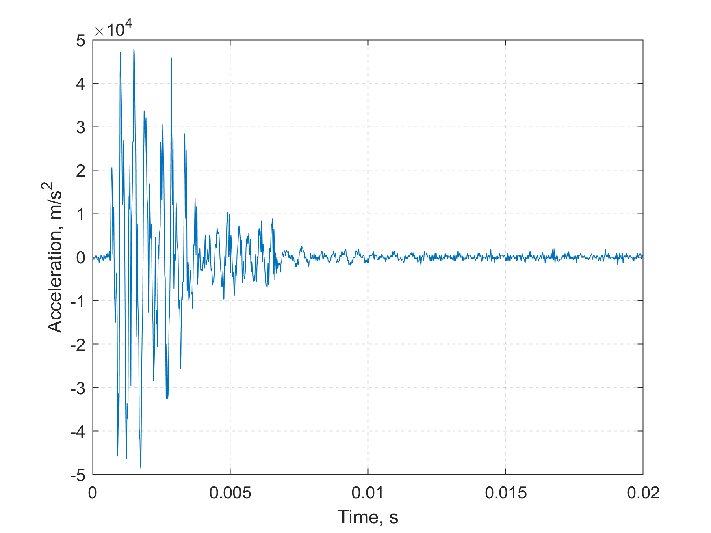
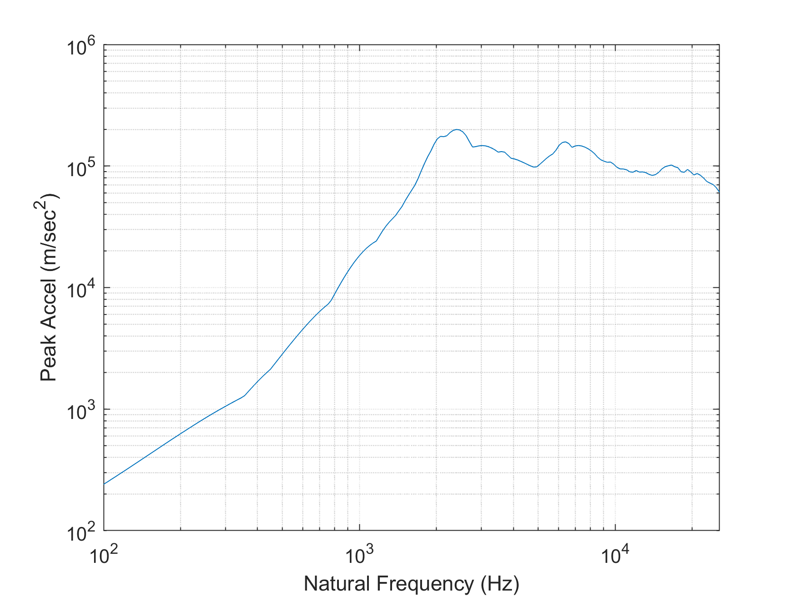
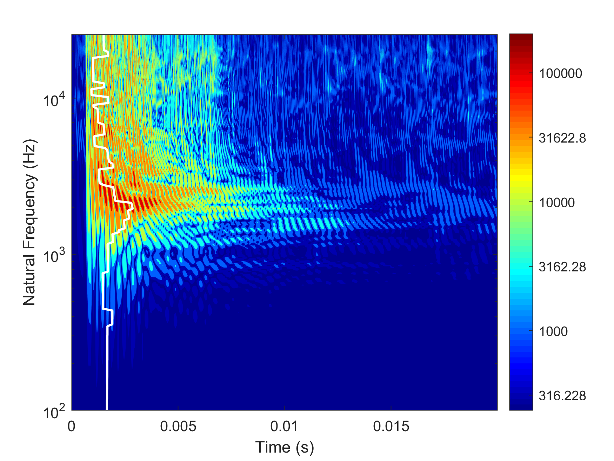
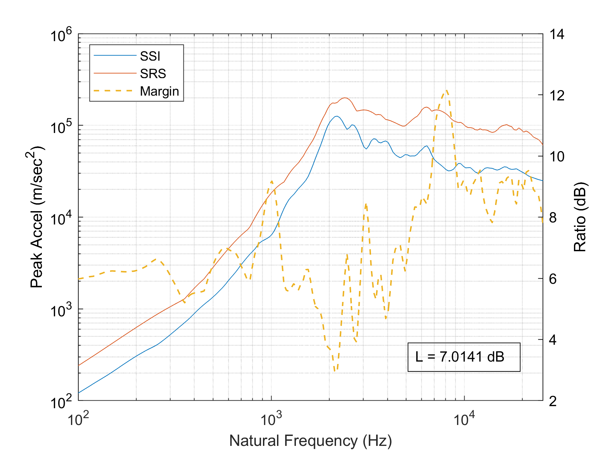
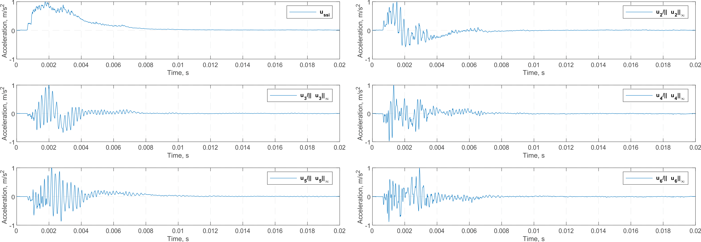
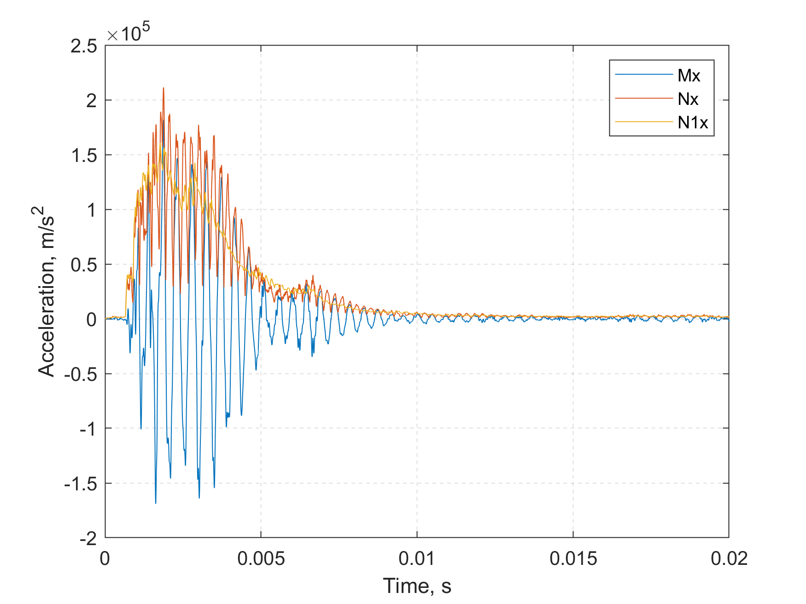

# Shock Severity Infimum Method

Code for the paper entitled "Metric of Shock Severity", which is currently under consideration by Proceedings of the Royal Society A.
The DOI and official link to this article will be uploaded once the paper is published.
This algorithm can shows the infimum of shock responses.

## Disclaimer
This software is published for academic and non-commercial use only.

## Usage
There are two classes in this repository.

The 'acc' class contains time and data information within its properties that describes an acceleration measurement.
It is a subclass of 'timeseries' class, so all methods in 'timeseries' class can be directly applied.
It also provide some overloaded simple function, such as FFT and plot, which can be directly use to analyse mechanical shock signals.
Helps can be accessed by `help acc` in MATLAB's command window.

The 'acc.srs' method is a function to extract the SRS and SRM from mechanical shocks.
The results are in the form of 'srs' objects, which come with some corresponding analysis methods.
Similarly, helps of 'srs' class can be accessed by `help srs` in MATLAB's command window.
>**srs** A collection of methods dealing with shock response matrix.
>
> **srs** Properties:  
>    fn - Natural frequencies of SDOF oscillators  
>    StaF - The starting frequency for srs  
>Q - Quality factor  
>t - Time column  
>resp - Shock response matrix
>
> **srs** Methods:  
>    srs - Constructor method to creat a srs object.  
>    plot - An overload plot function for srs object.  
>    contourf - Shock response contour (SRC).  
>    svd - Extract shock response infimum by SVD.  
>    mdof - Calculating shock response using response spectrum analysis methods.

The 'srs.contourf' function is for the shock response contour.
The SSI can be extracted by `srs.svd`.
The shock response can be estimated by `srs.mdof` function based on response spectrum analysis method.

## Example

This section demonstrates the example shown in the article.
Load the provided data in MAT-file, which contains four 'acc' objects and one modal information matrix.
Here only shock 'RVS' is analysed, since these functions can be applied to other shocks in the same way.
The time history of 'RVS' shock can be plotted by the overloaded 'plot' function.
```
load shock.mat;
RVS.plot;
```


Obtains the 'srs' object 'M', which contains a shock response matrix and its corresponding information.
In the shock response calculation process, the natural frequencies of SDOFs start from 100 Hz with damping Q=10.
With such 'srs' object, its SRS and SRC can be simply plotted.
```
M = RVS.srs(100,10);
M.plot;
M.contourf;
```



Extracts the **N**<sub>1</sub> matrix from the shock response matrix with singular decomposition method.
Call the `srs.svd` function without an output variable to view the dual spectrum, margin l and weighted singular vectors in time domain plot.
```
N1=M.svd(1);
M.svd(1);
```




Calculate structural response with various **Mx**, **Nx**, **v<sub>SRS</sub>x** and **v<sub>SSI</sub>x** methods.
Here 'MI' is the modal information of the cantilever beam, as shown in Table 1 in the paper.
```
[Mx, Nx]=M.mdof(MI);
```
> Absolute maximum response by matrix M is 181774.6927  
> Absolute maximum response by matrix N is 211316.9418  
> Absolute maximum response by maximaxSRS is 293779.6567  
> Cost function is 0.3047  
> Absolute maximum response by n1 is 160349.756

The following commands show the comparisons of time history plots of Mx, Nx and N1x.
```
Mx.plot;
hold on;
plot(Nx.Time, Nx.Data);
[~,N1x] = N1.mdof(MI);
plot(N1x.Time, N1x.Data);
legend('Mx','Nx','N1x');
```


## Acknowledgement
The code in SRS computation is partly based on the source code of the Vibrationdata Matlab Signal Analysis & Structural Dynamics Package provided by Tom Irvine.

## Contact
Feel free to contact me at [yinzhong.yan@nwpu.edu.cn](mailto:yinzhong.yan@nwpu.edu.cn).
